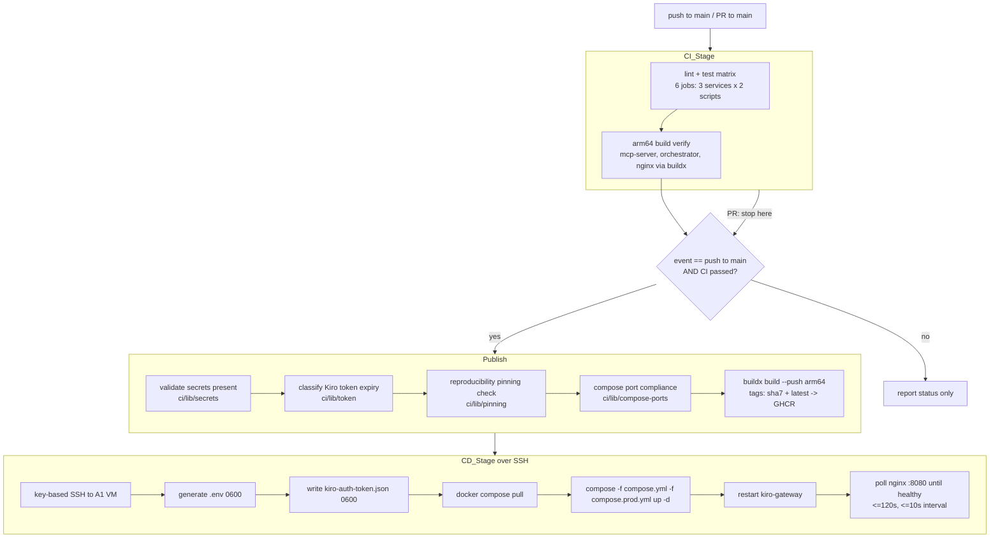

# Design Document: cloud-deploy-cicd

## Overview

This design automates build, test, and deployment of the OpenProject AI Agent stack to an Oracle Cloud Ampere A1 (arm64) Ubuntu VM. It replaces the manual VPS flow in the README (git clone, scp token, `compose up --build`) with a GitHub Actions pipeline that lints and unit-tests the three first-party services, verifies arm64 image builds, publishes images to GHCR, and deploys over SSH with a hardened production compose overlay.

A central design principle, driven directly by the user's directive, is **incremental delivery**: the work is split into eight phases, each of which lands on its own, is useful without the phases that follow, and ships with an explicit local or CI verification step. You can stop after any phase and have a strictly better repository than before. Early phases (test runner, linter) need no CI infrastructure at all and are verifiable on a laptop; later phases layer CI, then registry publishing, then deployment, then hardening on top.

A second principle is that **the pipeline's correctness-critical logic lives in small, pure Node modules**, not buried in YAML. Tag derivation, secret completeness validation, Kiro token expiry classification, compose port-binding compliance, and reproducibility pinning checks are all implemented as ESM functions under `ci/lib/`. This keeps the GitHub Actions YAML thin (it just calls `node ci/...`) and makes the risky logic unit- and property-testable with the same Vitest runner we add in Phase 1. The YAML, SSH wiring, and registry interactions remain integration/smoke concerns.

### Key research findings

- **arm64 builds in Actions**: GitHub-hosted `ubuntu-latest` runners are x86_64. Building `linux/arm64` images requires `docker/setup-qemu-action` (binfmt emulation) plus `docker/setup-buildx-action` (a buildx builder), then `docker/build-push-action` with `platforms: linux/arm64`. Emulated arm64 builds are slower than native, which is why Req 4.5 allows a 1800s per-image budget. ([Docker docs: multi-platform builds](https://docs.docker.com/build/building/multi-platform/))
- **GHCR auth**: The workflow authenticates to `ghcr.io` with the built-in `GITHUB_TOKEN` via `docker/login-action`, provided the job grants `permissions: packages: write`. No long-lived PAT is needed for same-repo pushes. ([GitHub docs: publishing to GHCR](https://docs.github.com/en/packages/managing-github-packages-using-github-actions-workflows/publishing-and-installing-a-package-with-github-actions)) Content rephrased for compliance.
- **SSH deploy**: `appleboy/ssh-action` wraps `ssh`/`scp` with key-based auth from secrets and is the common, low-ceremony choice; raw `ssh -i` with a key written from a secret is the dependency-free alternative. This design uses raw `ssh`/`scp` driven by a private key from `Secret_Store`, keeping the deploy mechanism transparent and auditable.
- **Vitest + ESM**: All three services are `"type": "module"` on Node >=20. Vitest runs native ESM with zero transform config, so it satisfies Req 1.7 without touching `"type": "module"`. `vitest run` is the non-watch invocation (Req 1.2). `vitest run --passWithNoTests=false` (the default) exits non-zero when no tests are found (Req 1.6).
- **Frontend Node pin**: The README and `frontend/package.json` pin Vite 5 + React 18 because newer Vite needs Node 20.19+. All CI jobs and Docker stages therefore pin Node 20 (specifically a `20.18`-compatible image) to match.

## Architecture

### Pipeline topology



### How phases map to requirements

| Phase | Deliverable | Requirements | How you verify this phase (standalone) |
|-------|-------------|--------------|-----------------------------------------|
| 1 | Vitest + ESLint configured per service, `test`/`lint` scripts | Req 1, 2 | Run `npm install && npm run lint && npm test` in each of `mcp-server/`, `orchestrator/`, `frontend/` locally. Green = done. No CI needed. |
| 2 | `ci.yml` lint+test matrix on push/PR to main | Req 3 | Open a PR; observe 6 checks (3 services x 2 scripts) run and report status. |
| 3 | arm64 build verification via buildx in CI | Req 4 | Push a commit; confirm the build job synth-builds all three images for `linux/arm64` and that nginx produces non-empty `widget.js`/`widget.css`. |
| 4 | Publish images to GHCR tagged `sha7` + `latest` on main | Req 5 | Merge to main; confirm three packages appear in GHCR with both tags. |
| 5 | CD over SSH: pull, compose up, health-check `:8080` | Req 6 | Trigger a deploy; confirm the VM serves a healthy response on 8080 and a failed deploy leaves the prior stack running. |
| 6 | Secrets `.env` generation + Kiro token delivery & expiry surfacing | Req 7, 8 | Run deploy; confirm `.env` and token are written `0600`, gateway restarts, and an expiring token surfaces a warning. |
| 7 | Production hardening: only nginx exposed, prod overlay, optional TLS | Req 9 | From the VM host, confirm connections to 3000/4000/8000 are refused while 8080 (or 443) answers. |
| 8 | Reproducibility checks + documentation | Req 10 | Run `node ci/lib/pinning` against the repo; confirm docs and pipeline config are consistent and unpinned images are rejected. |

Each phase is additive. Phases 1–4 change only repository files and CI config (zero production impact). Phase 5 first touches the live VM. Phases 6–8 harden and document what 5 established.

### Repository layout additions

```
openproject-agent/
├── .github/workflows/
│   ├── ci.yml                  # Phase 2-4: lint, test, arm64 build verify
│   └── deploy.yml              # Phase 4-6: publish to GHCR + CD over SSH
├── ci/
│   └── lib/
│       ├── tags.js             # short-SHA + tag derivation (Req 5.2)
│       ├── secrets.js          # secret completeness validation (Req 7.1, 7.7)
│       ├── token.js            # Kiro token parse + expiry classification (Req 8.6, 8.7)
│       ├── compose-ports.js    # host-port-binding compliance (Req 9.2, 9.5)
│       ├── pinning.js          # base-image + lockfile pinning check (Req 10.3, 10.4)
│       └── *.test.js           # Vitest unit + property tests for the above
├── docker-compose.prod.yml     # Phase 7: registry images, no internal host ports, optional TLS
├── mcp-server/   (+ vitest, eslint config, *.test.js)
├── orchestrator/ (+ vitest, eslint config, *.test.js)
├── frontend/     (+ vitest, eslint config, *.test.js)
└── docs/deployment.md          # Phase 8: secrets table, triggers, reproduce steps
```

The `ci/lib/` modules are plain ESM with no service dependencies, so they are tested by a root-level Vitest config (or a lightweight `ci/package.json`) independent of the three services.

## Components and Interfaces

### Phase 1 — Per-service test runner and linter

Each service gains, without changing `"type": "module"`:

- **Vitest** as a dev dependency, plus a `test` script: `"test": "vitest run"`. `vitest run` is single-shot (Req 1.2), exits 0 on pass (Req 1.3), non-zero on failure (Req 1.5), non-zero when no test files are found (Req 1.6, Vitest's default `passWithNoTests: false`), and prints a summary line with totals passed/failed (Req 1.4). To satisfy Req 1.6 every service ships at least one trivial test initially so green builds are honest rather than vacuous.
- **ESLint** (flat `eslint.config.js`) as a dev dependency, plus a `lint` script: `"lint": "eslint ."`. The flat config sets `languageOptions.sourceType: "module"`, targets `**/*.{js,jsx,mjs}`, and ignores `node_modules`, `dist` (Req 2.2). ESLint exits 0 with no violations (Req 2.3), non-zero otherwise, and its default stylish formatter reports file path, line, column, and rule id per violation (Req 2.4). The `frontend` config additionally enables `eslint-plugin-react`/JSX parsing for `.jsx`.

These scripts are the contract the CI matrix consumes in Phase 2; nothing about Phase 1 depends on CI existing.

### Phase 2 — CI lint/test matrix (`ci.yml`)

```yaml
on:
  push: { branches: [main] }
  pull_request: { branches: [main] }
```

A single job with a matrix over `service ∈ {mcp-server, orchestrator, frontend}` × `script ∈ {lint, test}` produces six independent jobs (Req 3.3). Each job: checks out, sets up Node 20, runs `npm ci` in the service dir, then `npm run <script>`. `fail-fast: false` lets the remaining jobs finish even when one fails (Req 3.4). `timeout-minutes: 15` enforces Req 3.6. A failing `npm ci` fails that job with the service identified by the matrix cell (Req 3.7). Branch protection on `main` requires all six checks, which is what blocks merge/deploy on failure (Req 2.6, 3.4).

### Phase 3 — arm64 build verification

A `build-verify` job (gated to run after lint/test, or in parallel but required) uses:

```yaml
- uses: docker/setup-qemu-action@v3
- uses: docker/setup-buildx-action@v3
- uses: docker/build-push-action@v6
  with: { context: ., file: ./<svc>/Dockerfile, platforms: linux/arm64, push: false, load: false }
```

run for `mcp-server`, `orchestrator`, and the root-context `nginx/Dockerfile` (Req 4.1). Any failing build fails the job and the matrix cell names the image (Req 4.3). A per-step `timeout-minutes: 30` enforces the 1800s budget (Req 4.5). For the nginx image, a follow-up step builds with `load: true` for arm64 emulation is impractical to load on x86; instead the design extracts the built `dist` by adding a verification stage: `build-push-action` writes a build summary and we run a container-free check by building the frontend stage and asserting `widget.js`/`widget.css` exist with non-zero size (Req 4.4) using `docker buildx build --target frontend-build --output type=local,dest=./_widget` then checking file sizes.

### Phase 4 — Publish to GHCR (`deploy.yml`, publish job)

Triggered only on `push` to `main` after CI passes (`workflow_run` dependency or a combined workflow with a `needs:` gate). Steps:

1. `docker/login-action` to `ghcr.io` using `GITHUB_TOKEN` with `permissions: packages: write` (Req 5 auth; 5.4 fails closed if login fails).
2. Compute tags with `node ci/lib/tags.js <full-sha>` → emits `sha7` and `latest` (Req 5.2).
3. `docker/build-push-action` with `platforms: linux/arm64`, `push: true`, `tags: ghcr.io/<owner>/<repo>-<svc>:<sha7>,...:latest` for each first-party image (Req 5.1, 5.3). Build-push retries are configured (3 additional attempts) for transient errors (Req 5.6); a per-image push `timeout-minutes: 10` enforces 600s (Req 5.5). Any push failure stops the workflow before CD (Req 5.4, 5.5).

`kiro-gateway` is third-party (`ghcr.io/jwadow/kiro-gateway`) and is never built or pushed — only first-party `mcp-server`, `orchestrator`, `nginx` are.

### Phase 5 — CD over SSH (`deploy.yml`, deploy job)

`needs: publish`. Connects to the A1 VM with key-based SSH (private key from `Secret_Store`, Req 6.5; failure aborts before delivering artifacts, Req 6.6). The deploy directory on the VM (`/opt/openproject-agent`) holds the committed `docker-compose.yml`, `docker-compose.prod.yml`, and the generated `.env`. Ordering (rollback-safe, Req 6.7, 6.8):

1. `scp` the two compose files to the VM (code/config, never secrets-in-repo).
2. Generate `.env` and write the Kiro token (Phase 6).
3. `docker compose ... pull` — if pull fails, abort and leave the running stack untouched (Req 6.7).
4. `docker compose -f docker-compose.yml -f docker-compose.prod.yml up -d` only after a successful pull (Req 6.2).
5. Poll `http://localhost:8080` on the VM at ≤10s intervals up to 120s; first non-error HTTP response = success (Req 6.3, 6.4).

Because `up -d` only runs after a successful `pull`, and Compose performs a rolling recreate, a failure at pull leaves the prior containers in place (Req 6.8).

### Phase 6 — Secrets and Kiro token

- `node ci/lib/secrets.js` reads the five required env-injected secrets (`OPENPROJECT_API_TOKEN`, `ANTHROPIC_API_KEY`, `PROFILE_ARN`, `CLAUDE_MODEL`, `OPENPROJECT_SECRET_KEY_BASE`). If any is missing/empty it prints each missing name and exits non-zero **before** any `.env` is written (Req 7.1, 7.7).
- The `.env` is rendered and written to the VM via an SSH heredoc with `umask 077`, then `chmod 600` (Req 7.2, 7.3); transport is SSH (encrypted, Req 7.4). Generation uses a temp file + atomic `mv`; failure removes the temp file so no partial `.env` remains (Req 7.8). GitHub Actions masks all secret values in logs (Req 7.5); `.env` and the token are git-ignored and never part of any committed artifact (Req 7.6).
- `node ci/lib/token.js` parses the Kiro token JSON from `Secret_Store`. Missing token → halt before any VM write (Req 8.8). Expiry in the past → halt before writing, warn (Req 8.6). Expiry ≤72h ahead → warn but proceed (Req 8.7). On proceed, the token is written to `~/.aws/sso/cache/kiro-auth-token.json` at `0600` (Req 8.2); write failure halts without restarting the gateway and leaves the prior token (Req 8.3). After a successful write the gateway is restarted (Req 8.4); if it is not running within 60s the deploy fails naming `kiro-gateway` (Req 8.5).

### Phase 7 — Production hardening (`docker-compose.prod.yml`)

An overlay merged after the base compose that:

- Removes host `ports` for `mcp-server`, `orchestrator`, `kiro-gateway` (override with `ports: []` is not a merge-clearing operation in Compose, so the prod overlay instead **redefines** these services without `ports` by using a base file that has no host ports and adds dev ports in a separate `docker-compose.override.yml` — see Data Models). Only `nginx` publishes a host port (Req 9.1, 9.2). Internal services stay reachable via the Docker network (Req 9.2), so host-network connections to 3000/4000/8000 are refused (Req 9.4).
- Optionally maps `443:443` (and `80:80` for redirect) on nginx when TLS is configured, serving HTTPS as the public entry point (Req 9.3) and redirecting HTTP→HTTPS (Req 9.6). TLS is opt-in via a documented env flag and mounted certs.
- `node ci/lib/compose-ports.js` parses the **effective merged** prod compose and flags any non-nginx service with a host port binding, refusing to start the stack and naming each violator (Req 9.5).

### Phase 8 — Reproducibility and docs

- `node ci/lib/pinning.js` scans each first-party Dockerfile for an unpinned `FROM` (no explicit version tag / digest) and verifies a committed `package-lock.json` accompanies each build context (Req 10.3). If any image is unpinned or missing a lockfile, CD stops before deploying and names the offending image, leaving the prior stack untouched (Req 10.4). This implies the Phase 1 Dockerfiles should move from `node:20-alpine` to a pinned `node:20.18-alpine3.xx`.
- `docs/deployment.md` lists every `Secret_Store` entry with name + purpose and states CI/CD trigger conditions (Req 10.1), is updated in the same change as any pipeline alteration (Req 10.2, enforced by a CI doc-consistency check that diffs the documented secret/trigger/image sets against the workflow files), and is sufficient to reproduce the deploy with no undocumented manual step (Req 10.5).

## Data Models

### Tag set (Req 5.2)

```
TagSet := { sha7: string (7 hex chars), latest: "latest" }
deriveTags(fullSha: string /* 40 hex */) -> TagSet
```

### Secret validation result (Req 7.1, 7.7)

```
REQUIRED_SECRETS := [OPENPROJECT_API_TOKEN, ANTHROPIC_API_KEY, PROFILE_ARN, CLAUDE_MODEL, OPENPROJECT_SECRET_KEY_BASE]
SecretCheck := { ok: boolean, missing: string[] /* names absent or empty */ }
validateSecrets(env: Record<string,string|undefined>) -> SecretCheck
```

### Kiro token model (Req 8.1, 8.6, 8.7, 8.8)

```
KiroToken := { refreshTokenExpiresAt?: ISO-8601 string, ...opaque }
ExpiryClass := "missing" | "expired" | "expiring_soon" | "ok"
WARN_WINDOW_MS := 72h
classifyToken(raw: string|undefined, now: epochMs) -> { class: ExpiryClass, expiresAt?: epochMs }
  - undefined/empty/unparseable-as-token         -> missing
  - expiresAt <= now                              -> expired
  - now < expiresAt <= now + 72h                  -> expiring_soon
  - expiresAt > now + 72h                         -> ok
```

The exact JSON field name for expiry is read from the real token file shape (`~/.aws/sso/cache/kiro-auth-token.json`); `classifyToken` accepts the parsed object so the field lookup is isolated and testable.

### Compose port-compliance model (Req 9.2, 9.5)

```
ComposeService := { name: string, ports?: (string|object)[] }
PortCheck := { compliant: boolean, violators: string[] /* non-nginx services with host ports */ }
checkComposePorts(services: ComposeService[], publicService = "nginx") -> PortCheck
```

A "host port binding" is any `ports` entry that publishes to the host (`"8080:80"`, `{ published: ..., target: ... }`). `expose`-only and no `ports` are compliant.

### Pinning model (Req 10.3, 10.4)

```
ImageBuild := { name: string, dockerfileText: string, hasLockfile: boolean }
PinCheck := { reproducible: boolean, offenders: { image: string, reason: "unpinned_base"|"missing_lockfile" }[] }
checkPinning(builds: ImageBuild[]) -> PinCheck
  - FROM with no tag, or tag == "latest"  -> unpinned_base
  - hasLockfile == false                  -> missing_lockfile
```

## Correctness Properties

*A property is a characteristic or behavior that should hold true across all valid executions of a system — essentially, a formal statement about what the system should do. Properties serve as the bridge between human-readable specifications and machine-verifiable correctness guarantees.*

Most of this feature is CI/CD orchestration, registry interaction, SSH side-effects, and runtime network behavior — all of which are verified by integration and smoke tests (see Testing Strategy), not property tests. Property-based testing is reserved for the **pure validation functions** in `ci/lib/`, where behavior varies meaningfully across a large input space and 100+ generated inputs find boundary bugs that a couple of examples would miss. The seven properties below are the consolidated result of the prework analysis (redundant per-criterion properties were merged).

### Property 1: Short-SHA tag derivation

*For any* 40-character hexadecimal commit SHA, `deriveTags` SHALL return a `sha7` that is exactly the first 7 characters of the input (length 7 and a prefix of the full SHA) and a constant `latest` tag, regardless of the SHA's content.

**Validates: Requirements 5.2**

### Property 2: Secret completeness validation

*For any* mapping of environment variable names to values, `validateSecrets` SHALL report `ok = true` with an empty `missing` list if and only if every one of the five required secret names is present with a non-empty value; otherwise `missing` SHALL contain exactly the required names whose value is absent or empty, and no others.

**Validates: Requirements 7.1, 7.7**

### Property 3: Environment file rendering

*For any* complete mapping that supplies a non-empty value for every required secret, the rendered `.env` content SHALL contain exactly one `NAME=value` line for each required secret, each line's value SHALL equal the value supplied for that name, and the rendered content SHALL contain no line for any name outside the required set.

**Validates: Requirements 7.2**

### Property 4: Kiro token expiry classification

*For any* token input and any reference time `now`, `classifyToken` SHALL return: `missing` when the input is absent, empty, or not parseable as a token; `expired` when the parsed expiry is at or before `now`; `expiring_soon` when the expiry is strictly after `now` but at or before `now + 72h`; and `ok` when the expiry is strictly after `now + 72h`.

**Validates: Requirements 8.6, 8.7, 8.8**

### Property 5: Production port-binding compliance

*For any* parsed compose configuration, `checkComposePorts` SHALL report `compliant = true` with no violators if and only if no service other than the public reverse proxy (`nginx`) declares a host port binding; otherwise `violators` SHALL contain exactly the non-`nginx` services that declare a host port binding, and no others.

**Validates: Requirements 9.1, 9.2, 9.5**

### Property 6: Documentation/pipeline consistency

*For any* set of items documented in `docs/deployment.md` (secret names, trigger conditions, first-party image names) and the corresponding set extracted from the pipeline configuration, the consistency check SHALL pass if and only if the two sets are equal — that is, every documented item is present in the pipeline configuration and every pipeline-configuration item is present in the documentation, with an empty symmetric difference.

**Validates: Requirements 10.2**

### Property 7: Reproducibility pinning

*For any* set of first-party image builds, `checkPinning` SHALL report `reproducible = true` with no offenders if and only if every build's Dockerfile `FROM` is pinned to an explicit non-`latest` version (or digest) and every build has a committed lockfile; otherwise `offenders` SHALL contain exactly the builds that violate a rule, each annotated with the correct reason (`unpinned_base` or `missing_lockfile`).

**Validates: Requirements 10.3, 10.4**

## Error Handling

The pipeline fails closed and rollback-safe. Errors are categorized by where they occur:

**CI_Stage (Phases 2–3)**
- A failing `lint`/`test`/build job fails its matrix cell while `fail-fast: false` lets siblings finish (Req 3.4). Branch protection blocks merge on any failed required check.
- `npm ci` failure, job timeout (15 min CI / 30 min build), and build failures all surface the offending service or image via the matrix cell label (Req 3.6, 3.7, 4.3, 4.5).

**Publish (Phase 4)**
- GHCR login failure stops the workflow before any push and before CD (Req 5.4). Transient push errors retry up to 3 additional times (Req 5.6); a per-image 10-minute timeout converts a stuck push into a named failure (Req 5.5).
- Pre-flight validators (`secrets`, `token`, `pinning`, `compose-ports`) run before any image is pushed or any VM is touched. Each exits non-zero and names the offending item, aborting the run (Req 7.7, 8.6, 8.8, 9.5, 10.4).

**CD_Stage (Phases 5–6)**
- SSH auth failure aborts before any artifact is delivered, reporting an auth failure (Req 6.6).
- Ordering guarantees rollback safety: compose files are copied, `.env`/token are written, then `docker compose pull` runs; `up -d` runs **only** after a successful pull. A pull failure (Req 6.7) or any post-pull failure (Req 6.8) leaves the previously running stack in place because the new images were never started.
- `.env` is written atomically (temp file + `mv`); a generation failure removes the temp file so no partial `.env` survives (Req 7.8).
- Token write failure halts without restarting the gateway and leaves the prior token (Req 8.3). After a successful write the gateway is restarted; failure to return to running within 60s fails the deploy naming `kiro-gateway` (Req 8.5).
- Health-check failure (no non-error response on `:8080` within 120s) marks the deploy failed (Req 6.4) without disturbing the prior stack.

**Secret hygiene**
- All `Secret_Store` values are masked in logs by the runner (Req 7.5); `.env` and the Kiro token are git-ignored and excluded from every artifact (Req 7.6); secrets travel only over SSH (Req 7.4).

## Testing Strategy

### Dual approach

- **Property tests** (Vitest + `fast-check`, ≥100 iterations each) cover the seven pure validation functions in `ci/lib/`. These are the only PBT-appropriate surfaces: pure functions over large input spaces with universal invariants.
- **Unit/example tests** cover concrete cases and edge cases for those same modules (e.g., a real `kiro-auth-token.json` shape, a `"8080:80"` string vs. a long-form `{published,target}` port, a `FROM node:20-alpine` that is considered unpinned because it lacks a patch version, an exact 72h boundary timestamp).
- **Integration tests** (1–3 examples each) cover everything that talks to GitHub Actions, GHCR, Docker buildx, the VM, and the network: CI triggers and matrix wiring, arm64 build + widget-asset extraction, registry push/tagging, SSH deploy ordering, `.env`/token permissions on the VM, gateway restart, health polling, and host-port refusal on 3000/4000/8000.
- **Smoke tests** cover one-time configuration: Vitest/ESLint presence per service, ESM compatibility, `.gitignore` excludes, SSH key-based auth, and documentation completeness.

Why PBT is not applied to the rest: GitHub Actions YAML, buildx, GHCR, and SSH deploys are declarative configuration and external-service interactions whose behavior does not vary meaningfully with generated input and whose per-run cost is high. Those are validated with representative integration/smoke tests, consistent with the project's CI/CD nature.

### Property test configuration

- Library: `fast-check` with Vitest, run via the same `test` script added in Phase 1 (root/`ci` config for `ci/lib/`).
- Minimum 100 iterations per property (`fc.assert(..., { numRuns: 100 })`).
- Each property test is tagged with a comment referencing its design property, in the format:
  `// Feature: cloud-deploy-cicd, Property {number}: {property_text}`
- Generators: `fc.hexaString({minLength:40,maxLength:40})` for SHAs; record generators with random subsets omitted/blanked for secrets; `fc.date()` offsets around `now`, `now+72h` for token expiry (including exact boundaries); compose-service arrays with randomized `ports` presence and service names (including and excluding `nginx`); Dockerfile-text builders with pinned/unpinned `FROM` and lockfile flags; paired documented/pipeline sets with injected symmetric differences.

### Per-phase verification (the user's "testable along the way" requirement)

1. **Phase 1**: `npm install && npm run lint && npm test` green in each service locally.
2. **Phase 2**: Open a PR; six checks run and report.
3. **Phase 3**: arm64 build job passes for all three images; nginx `dist` yields non-empty `widget.js`/`widget.css`.
4. **Phase 4**: Merge to main; three GHCR packages appear tagged `sha7` + `latest`.
5. **Phase 5**: Deploy run; VM answers healthy on `:8080`; a forced pull failure leaves the old stack running.
6. **Phase 6**: `.env` and token written `0600`; gateway restarts; an expiring/expired token surfaces the documented warning/halt.
7. **Phase 7**: From the VM host, 3000/4000/8000 refuse connections while 8080 (or 443) answers; `checkComposePorts` flags any stray host port.
8. **Phase 8**: `node ci/lib/pinning.js` passes on the pinned Dockerfiles and fails a deliberately unpinned one; docs/pipeline consistency check passes.

## Open Technical Decisions

These are reasonable defaults; flagging them in case you want a different call:

- **Deploy mechanism**: raw `ssh`/`scp` with a key from `Secret_Store` (transparent, dependency-free) vs. `appleboy/ssh-action` (less boilerplate). Design assumes raw SSH.
- **Single vs. split workflow**: CI in `ci.yml`, publish+CD in `deploy.yml` gated on a successful CI run via `workflow_run`. A single combined workflow with `needs:` gates is the alternative.
- **TLS**: treated as opt-in (Req 9.3/9.6 are `WHERE TLS termination is configured`). Default deploy exposes nginx on 8080 as today; enabling TLS maps 80/443 and mounts certs.
- **Dockerfile pin target**: Phase 8 requires moving `node:20-alpine` → a patch-pinned tag (e.g. `node:20.18-alpine3.20`) to satisfy Req 10.3; exact patch/digest to confirm.
